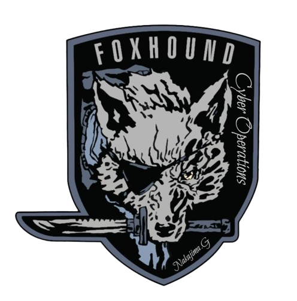
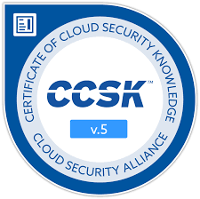

  

Welcome CyberFoxHound Learners! 🚀

This repository is dedicated to providing summaries, tips, and guides for various cybersecurity certifications. Whether you're just starting your cyber journey or looking to reinforce your knowledge, you'll find valuable insights here.

📜 Certifications Covered

- Certified Cloud Security Knowledge (CCSK)
- Certified Competence in Zero Trust (CCZT) (soon! ...)

🛠️ How to Use This Repository

Each certification has its own folder containing:

Summaries: Concise breakdowns of key topics.

Tips & Tricks: Advice to help you pass exams and apply knowledge effectively.

Guides & Resources: External references and study materials.

📌 Contribution & Feedback

If you have suggestions or would like to contribute, feel free to submit a pull request or open an issue.

Happy learning! 🦊🔐

